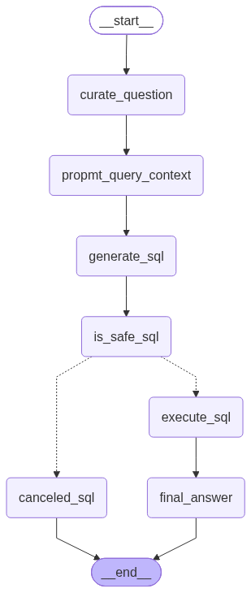

# Agentic AI-Based Multi-Source Data Retrieval and Stakeholder Intelligence Platform

A Python-based, agent-driven data intelligence project for turning natural-language questions into safe SQL queries against a PostgreSQL database. The system blends LLM-based reasoning with rule-based SQL validation, schema introspection, and a structured data pipeline to support stakeholder intelligence workflows.

## Overview

This project is designed to help users ask business questions in plain English and retrieve insights from a structured transportation and payments dataset. The system attempts to:

- interpret a user request using an LLM,
- generate a PostgreSQL query from a database schema,
- validate that the SQL is read-only and safe to execute,
- run the approved query against a PostgreSQL instance,
- return a final answer grounded in the database results.

The current repository includes:

- agent logic for SQL generation and safety review,
- an ETL agent with extraction, transformation, and loading tools,
- PostgreSQL database setup and CSV ingestion scripts,
- a schema model used for agent state tracking,
- Gemini-based model selection and API configuration.

## Key Features

- Natural-language-to-SQL workflow
- Deterministic SQL safety checks before execution
- LLM judge layer to assess query safety
- PostgreSQL schema introspection and sample data extraction
- CSV-driven database population for a rides, payments, ratings, users, and vehicles dataset
- API extraction and Pandas-based transformation tools for ETL workflows
- Structured Pydantic agent state models for orchestration

## Architecture

The project is organized into a few focused modules:

- [main.py](main.py): current starter entry point; the individual agent graphs are currently run from their own modules.
- [agents/sql_analyst.py](agents/sql_analyst.py): SQL analyst LangGraph workflow for question curation, schema-aware SQL generation, safety validation, execution, and answer generation.
- [agents/etl_analyst.py](agents/etl_analyst.py): ETL analyst LangGraph workflow that selects extraction and transformation tools based on the user's request.
- [utils/database.py](utils/database.py): PostgreSQL connection utilities and schema inspection helpers.
- [utils/feed_db.py](utils/feed_db.py): creates the PostgreSQL schema and loads CSV files into the database.
- [utils/llm_pick.py](utils/llm_pick.py): selects the Gemini LLM model tier and resolves API credentials.
- [models/schema.py](models/schema.py): Pydantic schemas for agent state and validation.
- [data/](data/): source CSV files used to populate the database.

### Current SQL Analyst Graph

The SQL analyst follows a guarded read-only workflow. Unsafe queries are canceled; approved queries are executed and summarized from their database results.



The generated graph is also available as [sql_analyst_graph.png](sql_analyst_graph.png). The ETL graph is generated as [etl_analyst_graph.png](etl_analyst_graph.png) when the ETL module's graph visualization block is run.

### Planned Parent Agent

The next orchestration layer will be a parent agent responsible for deciding which specialist workflow should run:

```text
User question
	|
	v
Parent agent / router
	|
	+--> SQL analyst agent --> safe SQL execution --> answer
	|
	+--> ETL analyst agent --> extract/transform/load --> result
```

The parent agent is planned work and is not wired into `main.py` yet. It will provide the single entry point for routing stakeholder questions to the SQL or ETL specialist while preserving each specialist's existing safety and tool boundaries.

## Data Model

The PostgreSQL database is structured around a ride-sharing and stakeholder intelligence domain, including tables such as:

- users
- vehicles
- rides
- payments
- ratings

These tables support queries around rider behavior, driver activity, trip performance, payment histories, and rating trends.

## Tech Stack

- Python 3.12+
- PostgreSQL
- psycopg2
- LangChain + LangGraph
- Google Gemini via LangChain Google GenAI
- Pydantic
- python-dotenv

## Project Structure

```text
.
├── agents/
│   ├── etl_analyst.py
│   ├── scratch.py
│   └── sql_analyst.py
├── data/
│   ├── payments.csv
│   ├── ratings.csv
│   ├── rides.csv
│   ├── users.csv
│   └── vehicles.csv
├── models/
│   └── schema.py
├── utils/
│   ├── database.py
│   ├── etl_tools.py
│   ├── feed_db.py
│   └── llm_pick.py
├── .env
├── main.py
├── pyproject.toml
├── README.md
├── schema_info.txt
└── ...
```

## Prerequisites

Before running the project, make sure you have:

1. Python 3.12 or newer
2. PostgreSQL running locally or in a reachable environment
3. A Gemini API key from Google AI Studio or a compatible Google AI project
4. Access to the database credentials for your PostgreSQL instance

## Environment Configuration

Create a `.env` file in the project root with values similar to the following:

```env
DB_HOST=localhost
DB_PORT=5432
DB_NAME=your_database_name
DB_USER=your_postgres_user
DB_PASSWORD=your_postgres_password
GEMINI_API_KEY=your_gemini_api_key
# Optional fallback
# GOOGLE_API_KEY=your_google_api_key
```

The project uses `python-dotenv` to load environment variables automatically.

## Setup

From the project root, install dependencies:

```bash
python -m pip install -e .
```

If the environment is not configured as an editable install, you may also install the dependencies listed in [pyproject.toml](pyproject.toml):

```bash
python -m pip install google-api-core ipython langchain-google-genai psycopg2-binary pydantic python-dotenv
```

## Database Setup

Create the PostgreSQL schema and load the CSV data:

```bash
python utils/feed_db.py
```

This script will:

- create the required tables,
- insert data from the CSV files in [data/](data/),
- validate row counts,
- exit after committing the transactions.

## Running the Project

The top-level runtime entry point is still minimal:

```bash
python main.py
```

To run the SQL analyst graph directly, configure PostgreSQL and the Gemini API key first, then run:

```bash
python agents/sql_analyst.py
```

To run the ETL analyst graph directly:

```bash
python agents/etl_analyst.py
```

Both agent modules currently include executable examples under their `__main__` blocks. They also generate LangGraph PNG visualizations when the optional visualization code runs.

## How the Agent Workflow Works

1. A user asks a business question in natural language.
2. The SQL analyst agent curates and clarifies that question.
3. A prompt is built using schema metadata and sample data from PostgreSQL.
4. An LLM generates one candidate SQL query.
5. A deterministic safety layer blocks dangerous operations such as `INSERT`, `UPDATE`, `DELETE`, `DROP`, `ALTER`, and other non-read-only actions.
6. A structured LLM judge reviews queries that pass the deterministic checks.
7. Approved queries are checked again immediately before execution, run against PostgreSQL, and summarized into the final answer.

The ETL analyst uses a separate tool-calling graph:

1. The LLM receives the user's ETL request and conversation state.
2. It selects the extraction or transformation tool when needed.
3. The tool result is returned to the LLM for the next step.
4. The graph ends after the requested operation is completed.

## Security Notes

This project intentionally enforces read-only SQL safety checks. The SQL validator rejects:

- data modification queries,
- schema-changing statements,
- transaction control commands,
- multi-statement SQL,
- dangerous PostgreSQL functions,
- SQL comments used to hide malicious logic.

This is a useful pattern for building safe LLM-powered database analytics systems.

## Current Status

This is a functional starter project with core database and specialist-agent infrastructure, but it still requires integration work depending on your end-user workflow. In particular:

- the app entry point is still minimal,
- the SQL and ETL agents are implemented independently but are not yet routed through a parent agent,
- the agent logic is modular but not yet fully exposed through a user-facing interface,
- the database connection depends on an existing PostgreSQL instance and `.env` configuration.

## License

This project does not currently include a license file. If you plan to share or distribute it publicly, add an appropriate open-source license before release.

## Contact / Next Steps

If you want to extend this project further, the most valuable next steps are:

- add a command-line application or web interface,
- add the parent agent that routes each request to the SQL or ETL analyst,
- expose the SQL analyst as an end-to-end API,
- create a proper dashboard or stakeholder reporting layer,
- expand the ETL pipeline and analytics agents,
- add automated tests for SQL safety and data validation.

