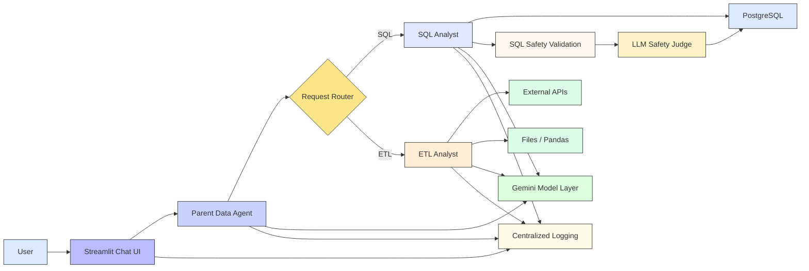
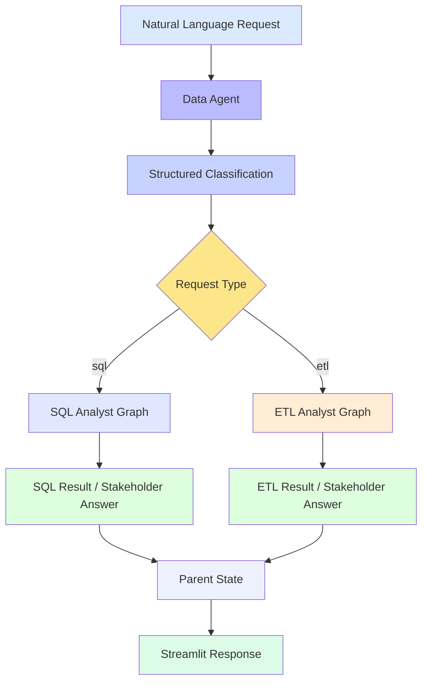
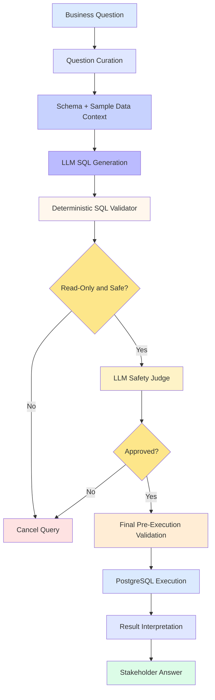
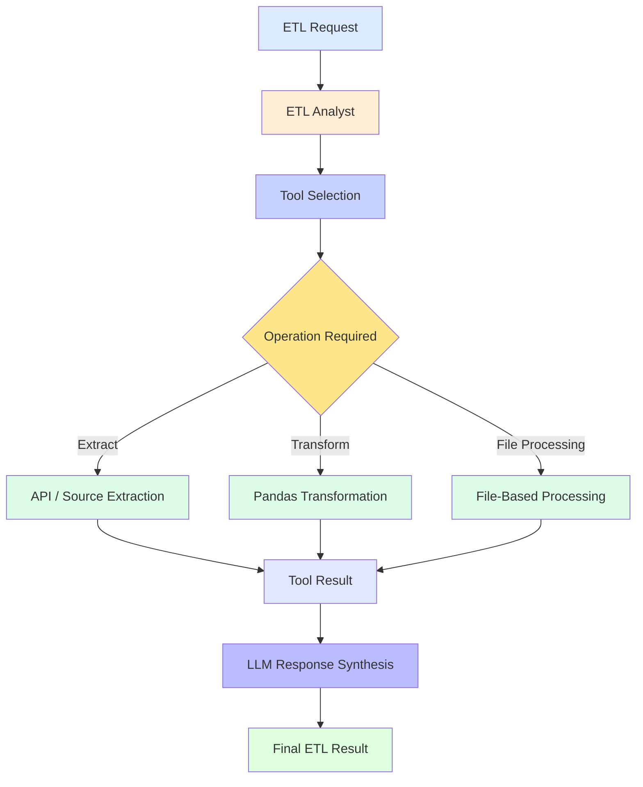
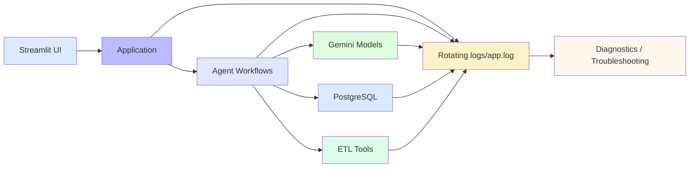

# Agentic AI-Based Multi-Source Data Retrieval and Stakeholder Intelligence Platform

A Python-based, agent-driven data intelligence platform for turning natural-language questions into actionable results across SQL analytics and ETL workflows. The system combines LLM-based reasoning, LangGraph orchestration, deterministic SQL safety validation, PostgreSQL schema introspection, API/file-based ETL tools, centralized logging, and a Streamlit chat interface.

## Overview

This project is designed to help users interact with transportation and payments data using natural language instead of writing SQL or manually coordinating ETL steps.

The platform currently provides two specialist workflows:

- **SQL Analyst** — interprets a business question, uses PostgreSQL schema metadata and sample data to generate SQL, validates that the query is safe and read-only, executes the approved query, and produces a final answer.
- **ETL Analyst** — selects extraction and transformation tools for API/file workflows and returns the result to the agent.
- **Data Agent / Parent Router** — classifies an incoming request as `sql` or `etl` and routes it to the appropriate specialist workflow.
- **Streamlit UI** — provides a ChatGPT-style interface for interacting with the Data Agent, including chat history, suggested questions, analyst/model metadata, model health checks, and user-friendly error handling.
- **Centralized logging** — application activity is written to both the console and a rotating `logs/app.log` file.

## Key Features

- Natural-language-to-SQL workflow
- Parent agent that routes requests to SQL or ETL specialists
- Deterministic read-only SQL safety validation before execution
- Structured LLM judge for an additional SQL safety review
- PostgreSQL schema introspection and sample-data context
- CSV-driven PostgreSQL database population
- API extraction and Pandas transformation tools for ETL workflows
- Gemini model tiers with centralized configuration
- Model fallback handling for unavailable/rate-limited models
- Retry handling for temporary service/server failures
- Streamlit chat interface with conversation history
- Suggested business questions from the welcome screen
- Live model status checks for configured Gemini tiers
- Response metadata showing analyst, model tier, and execution time
- Safe frontend error messages while detailed errors are retained in logs
- Centralized rotating file logging for application diagnostics
- Structured Pydantic agent state models

## Architecture

### Platform Architecture



### Multi-Agent Routing



### SQL Analyst Guarded Workflow



### ETL Analyst Workflow



### Observability Flow



### Architecture Notes

- **Streamlit** is the user-facing interaction layer.
- **Data Agent** provides top-level routing and orchestration.
- **SQL Analyst** handles schema-aware analytical requests.
- **ETL Analyst** handles extraction and transformation requests.
- **LangGraph** manages the stateful specialist workflows.
- **Gemini** provides routing, reasoning, SQL generation, safety review, and response synthesis.
- **PostgreSQL** provides structured source data and schema metadata.
- **Deterministic SQL validation** is the first safety boundary before database execution.
- **LLM safety judging** provides a second review layer for generated SQL.
- **Centralized logging** captures operational events without exposing API credentials.

### Existing Agent Graphs

The repository also includes generated graph images:

- [SQL Analyst graph](sql_analyst_graph.png)
- [ETL Analyst graph](etl_analyst_graph.png)
- [Data Agent graph](data_agent_graph.png)

## Streamlit User Interface

The Streamlit application in [app.py](app.py) provides:

- ChatGPT-style conversation flow
- New Chat and session-based history
- Suggested business questions
- SQL Analyst and ETL Analyst capability cards
- Gemini LOW, MEDIUM, and HIGH model status
- Test All Models functionality
- Analyst/model/execution-time response metadata
- User-friendly error handling
- Custom responsive application styling

Run the UI with:

```bash
streamlit run app.py
```

> The Data Agent currently uses the configured MEDIUM model tier for routing. The model-status panel can test all configured tiers independently.

## Gemini Model Handling

Gemini configuration is centralized in [utils/llm_pick.py](utils/llm_pick.py).

The application defines three logical tiers:

- `LOW`
- `MEDIUM`
- `HIGH`

The LLM factory supports centralized configuration, API-key fallback, structured output, tool-enabled models, retries, and fallback handling for quota, rate-limit, unavailable-model, and temporary service errors.

## Logging and Observability

Centralized logging is configured through [logging_config.py](logging_config.py).

It provides:

- console logging,
- rotating `logs/app.log`,
- 5 MB rotation threshold,
- up to 3 backup files,
- consistent timestamp/level/logger/message formatting,
- reduced verbosity for noisy third-party libraries.

## Data Model

The PostgreSQL database is structured around a ride-sharing and stakeholder intelligence domain:

- users
- vehicles
- rides
- payments
- ratings

These datasets support analysis of rider behavior, driver activity, trip performance, payments, and ratings.

## Tech Stack

- Python 3.12+
- PostgreSQL
- psycopg2
- LangChain
- LangGraph
- Google Gemini via LangChain Google GenAI
- Streamlit
- Pandas
- Requests
- Pydantic
- python-dotenv
- Python rotating-file logging

## Project Structure

```text
.
├── agents/
│   ├── __init__.py
│   ├── data_agent.py
│   ├── etl_analyst.py
│   ├── scratch.py
│   └── sql_analyst.py
├── data/
│   └── load/
│       ├── payments.csv
│       ├── ratings.csv
│       ├── rides.csv
│       ├── users.csv
│       └── vehicles.csv
├── models/
│   ├── __init__.py
│   └── schema.py
├── utils/
│   ├── data/
│   │   └── extract/
│   ├── database.py
│   ├── etl_tools.py
│   ├── feed_db.py
│   └── llm_pick.py
├── logs/
│   └── app.log
├── app.py
├── logging_config.py
├── main.py
├── pyproject.toml
├── README.md
├── schema_info.txt
├── data_agent_graph.png
├── etl_analyst_graph.png
├── sql_analyst_graph.png
└── uv.lock
```

## Setup

### Prerequisites

- Python 3.12+
- PostgreSQL
- Gemini API key
- PostgreSQL credentials

### Environment

Create `.env`:

```env
DB_HOST=localhost
DB_PORT=5432
DB_NAME=your_database_name
DB_USER=your_postgres_user
DB_PASSWORD=your_postgres_password
GEMINI_API_KEY=your_gemini_api_key

# Optional fallback
# GOOGLE_API_KEY=your_google_api_key
```

### Install

```bash
python -m pip install -e .
```

For reproducible dependency resolution, the repository also contains `uv.lock`.

## Database Setup

Run:

```bash
python utils/feed_db.py
```

This creates the required tables, loads the CSV files from `data/load/`, validates row counts, and commits the changes.

## Running the Project

### Streamlit

```bash
streamlit run app.py
```

### Parent Data Agent

```bash
python agents/data_agent.py
```

### SQL Analyst

```bash
python agents/sql_analyst.py
```

### ETL Analyst

```bash
python agents/etl_analyst.py
```

### Application Entry Point

```bash
python main.py
```

## Security Notes

The SQL workflow enforces read-only safety checks and rejects data modification, schema-changing, transaction-control, multi-statement, dangerous-function, and comment-obfuscation patterns.

The ETL code-execution utility currently uses Python `exec()` for transformation execution. This is **not production-safe for untrusted or LLM-generated code** and should be isolated or sandboxed before production use.

Frontend exceptions are logged with technical details while the UI returns a generic failure message.

## Current Status

### Implemented

- SQL Analyst LangGraph workflow
- ETL Analyst LangGraph workflow
- Parent Data Agent routing
- PostgreSQL schema inspection and CSV loading
- Deterministic SQL safety validation
- LLM SQL safety review
- Gemini model-tier configuration
- Model fallback and retry handling
- Streamlit chat interface
- Suggested questions and new-chat handling
- Model health testing
- Response metadata
- Centralized rotating application logging
- User-facing error handling

### Remaining Work

- More specialist agents
- Secure sandbox for ETL code execution
- Automated unit/integration tests
- Production API and authentication
- Stakeholder dashboards and reporting

## Production Roadmap

```mermaid
flowchart LR
    A["Current Platform"] --> B["Additional Specialist Agents"]
    B --> C["Secure Tool Sandbox"]
    C --> D["Automated Evaluation"]
    D --> E["Authentication and API Layer"]
    E --> F["Observability and Governance"]
    F --> G["Production Stakeholder Intelligence Platform"]

    style A fill:#dbeafe
    style B fill:#e0e7ff
    style C fill:#fff7ed
    style D fill:#fde68a
    style E fill:#ffedd5
    style F fill:#c7d2fe
    style G fill:#dfd
```



## License

This project does not currently include a license file. If you plan to distribute it publicly, add an appropriate open-source license.
